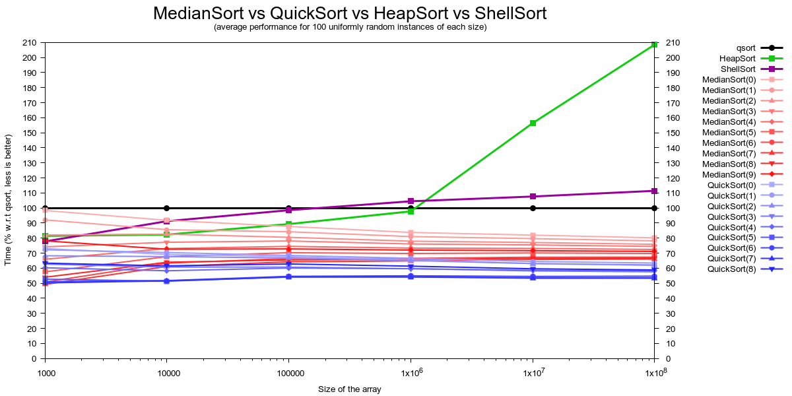
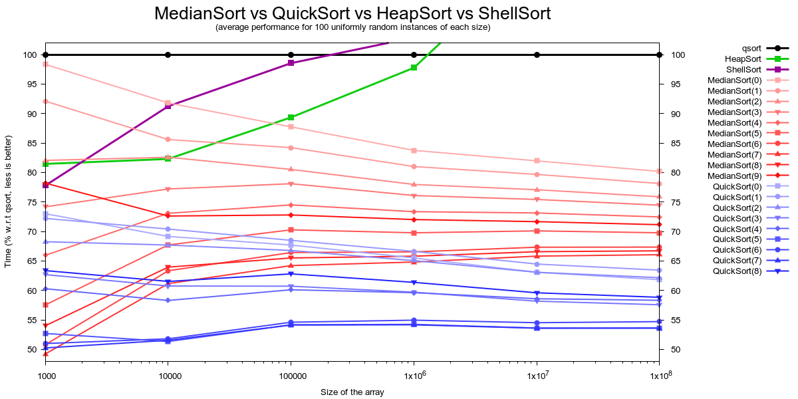

# MedianSort.c

A rather obscure sorting algorithm called **MedianSort**:

```c
    void median_sort(type_t *A, const size_t length) {

        size_t left, right, rank, step;

        for (step   = 1; step <  length; step <<= 1);
        for (step >>= 1; step >= 1;      step >>= 1) {
            for (rank = step; rank < length; rank += (step << 1)) {
                left  = (rank-step);
                right = (rank+step) > length ? length : (rank+step);
                quick_select(A+left, right-left, step);
            }
        }
    }
```


## The algorithm

The basic idea is to sort the array by calling the `quick_select` function on
a predefined set of semi-open intervals that only depends on `length`.

Sounds complicated, but it is just QuickSort in disguise.

For an array of length 16, the set of intervals will be:

```
    0   1   2   3   4   5   6   7   8   9  10  11  12  13  14  15

    [<------------------------------M------------------------------>)
    [<--------------M-------------->)
                                    [<--------------M-------------->)
    [<------M------>)
                    [<------M------>)
                                    [<------M------>)
                                                    [<------M------>)
    [<--M-->)
            [<--M-->)
                    [<--M-->)
                            [<--M-->)
                                    [<--M-->)
                                            [<--M-->)
                                                    [<--M-->)
                                                            [<--M-->)
```

This interval structure mimics the one you would find in QuickSort's best
case (picking the median as pivot every single time) but here we are
enforcing it artificially, which hurts the efficiency a bit.

In exchange, we gain A LOT of predictability: Knowing in advance the interval
structure means that we don't need to store the interval limits at all,
freeing us from using recursive calls (like QuickSort does) or a stack of
unsolved problems (like Iterative Quicksort does) to book-keep them.

Apart from giving us a non-recursive, truly `O(1)` space, QuickSort variant,
this interval structure works well with the modern processor's cache hierarchy,
since almost all the intervals end up having lengths that are a powers of 2,
even for arrays of lengths that are not a power of 2:

```
    0   1   2   3   4   5   6   7   8   9  10  11

    [<------------------------------M---------->)
    [<--------------M-------------->)
    [<------M------>)
                    [<------M------>)
                                    [<------M-->)
    [<--M-->)
            [<--M-->)
                    [<--M-->)
                            [<--M-->)
                                    [<--M-->)
```


## Improvements

Since all the work is done by the `quick_select` function, it is fundamental to
use a good implementation. After all, **MedianSort** inherits all its good
properties from the `quick_select` function that you use. In particular:

* If `quick_select` uses `O(1)` space, **MedianSort** will use `O(1)` space.
* If `quick_select` is non-recursive, **MedianSort** will be non-recursive.
* If `quick_select` is fast in practice, **MedianSort** will be fast in practice.
* If `quick_select` works in `O(interval length)` time, **MedianSort** will work
  in `O(length * log(length))` time.

I use a lighting fast `quick_select` function that does not guarantee linear
performance, but you may prefer to play safe and use a slower `quick_select`
function that works well for all inputs. Since there is a lot of literature on
`quick_select` variants, you may be able to pick one that suits your needs.


Apart from using a good `quick_select` implementation, you can improve the
performance of the algorithm by just stopping it earlier (to avoid calling
`quick_select` on lots of short intervals) and doing a final `insertion_sort`
over the whole array. In particular, if you avoid calling `quick_select` on
intervals that are shorter than `2^(power+1)` (being `power` a non-negative
parameter), then the `insertion_sort` step will take `O(2^(power+1) * length)`
time in the worst case.

```c
    void median_sort(type_t *A, const size_t length, const size_t power) {

        const size_t MIN_SIZE = (1 << power);

        size_t left, right, rank, step;

        /* MEDIAN SORT (down to 2^(power+1) intervals) */
        for (step   = 1; step <  length;   step <<= 1);
        for (step >>= 1; step >= MIN_SIZE; step >>= 1) {
            for (rank = step; rank < length; rank += (step << 1)) {
                left  = (rank-step);
                right = (rank+step) > length ? length : (rank+step);
                quick_select(A+left, right-left, step);
            }
        }

        /* INSERTION SORT (up to 2^(power+1) distances) */
        if (MIN_SIZE > 1) { insertion_sort(A, length); }
    }
```

Indeed, the parameter `power` can be tuned to adapt **MedianSort** to
different degrees of presortedness of the input data (increase it if
your data is almost sorted, decrease it if your data is fairly random).


Finally, an obvious optimization (that I haven't tried so far) is to
parallelize the `quick_select` calls. This is trivially easy since all the
intervals of the same size are disjoint by definition and can be processed
in parallel.


## Benchmark

I've ran a little experiment to test the efficiency of **MedianSort**.

For each array size, I've generated 10 random instances (each cell of the
array contains an uniformly random integer in the range `[0, size)`) and tested
my own implementations of `median_sort` and `quick_sort` using as a reference
the `qsort` function of C. In both cases I've tested different values of `power`
(including `0`, which avoids using `insertion_sort` at all).

Plotting all together may be a little bit confusing:

  

So let me summarize the results in this second plot:

  

As you can see, the best QuickSort version, `quick_sort(6)`, is twice as fast as
`qsort` on average, while the best **MedianSort** version, `median_sort(6)`, is
just 40% better than `qsort` on average.

In both cases, using `insertion_sort` is clearly helping, since the performance
of their pure counterparts, `quick_sort(0)` and `median_sort(0)`, is on the
lower end of their respective spectra.

For the sake of completeness, I've also plotted the performance of my own
implementation of `heap_sort`, often considered as a _fail proof_ sorting
algorithm but way slower than the alternatives for large arrays.


## Summary

The main advantages of **MedianSort** are:

 * It is non-recursive and uses `O(1)` space in the strict sense.
 * Its expected execution time is optimal: `O(length * log(length))`.
 * It is fast in practice and works faster for partially sorted arrays.
 * It can be easily expressed in terms of `quick_select` and `insertion_sort`.
 * Has a good cache performance and can be parallelized.
 * Can be tuned using the parameter `power`.

The main drawbacks of **MedianSort** are:

 * Can degenerate into `O(length^2)` for some inputs, just as QuickSort.
 * Good QuickSort implementations are faster in practice.


## License

Some days ago I was looking for a comparison-based sorting algorithm such that:

 * Uses `O(1)` space (strictly) to sort an array.
 * It is fast in practice (and works faster in partially sorted arrays).
 
After doing some research I was unable to find a satisfying algorithm so I had
to (re)invent **MedianSort**.

After another round of research I found that the algorithm was already
known (as you can expect from such a simple idea) but poorly divulgated.

So far, I've been able to find just ONE reference to **MedianSort** in the
literature (please, provide more references if you are aware of them):

A recursive version of **MedianSort** appeared in the first edition of the book
_Algorithms in a Nutshell_ by George T. Heineman, Gary Pollice and Stanley
Selkow.

But, since a recursive version of **MedianSort** has no advantage over
QuickSort, the algorithm dissapeared from the second edition and fell into an
unjustified oblivion.

This PUBLIC DOMAIN prototype aims to correct that situation. Use this code as
you see fit.

